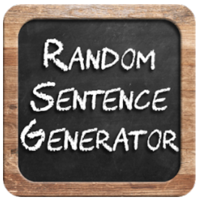

# 🎲 Random Sentence Generator (Python)

## 📋 Description

A playful Python console application that creates random, amusing sentences from predefined word lists.  
Every sentence is unique and can be used for fun with friends or even for quirky social media posts.

---

## 📖 How It Works

The generated sentence follows a straightforward pattern:

- **Who + Where:** [Name + from + Place] → e.g., `David from Sofia`  
- **Action:** [Adverb + Verb + Noun] → e.g., `slowly eats cake`  
- **Extra Detail:** Context like “near the river”, “in the park”, or “at home”.

---

## 🎯 Main Features

- Predefined arrays of words: names, places, verbs, nouns, adverbs, and extra details.  
- Random selection of one element from each category.  
- Sentence creation by combining selected words according to the pattern.  
- Loop-based generation: pressing Enter creates a new sentence.  
- Ability to pause or exit when desired.  
- Clear and user-friendly console output.

---

## 🛠 Implementation Breakdown

- **Sentence Structure:** Combines words from different categories into a coherent phrase.  
- **Random Selection:** Uses Python `Random` to pick words from arrays.  
- **Reusable Method:** A helper function that takes an array and returns a random word.  
- **Main Loop:** Continuously generates new sentences until the user chooses to stop.  
- **User Prompt:** Displays instructions for generating more content.

---

## ▶️ Running the Application

1. Clone or download the repository.  
2. Open the project in PyCharm or another Python-compatible IDE.  
3. Build and run the solution.  
4. Press **Enter** to get a fresh random sentence.

---

## 📂 Key Methods

- `GetRandomWord(string[] words)` → Picks a random element from a given array.  
- **Main Loop** → Calls `GetRandomWord()` for each category, assembles the sentence, and prints it.  
- **Output Handler** → Shows the generated text and prompts for the next action.

---

## 🖥 Example Output
`David from Sofia slowly eats cake near the river.`

`Press [Enter] to generate a new sentence...`

---

## 💡 Ideas for Expansion

- Add more words and categories for richer combinations.  
- Support more complex sentence structures or questions.  
- Add a simple graphical user interface (GUI).  
- Save generated sentences into a file.  
- Implement a timer or sentence limit for each session.

---

## 📜 License

This project is licensed under the **MIT License**.
